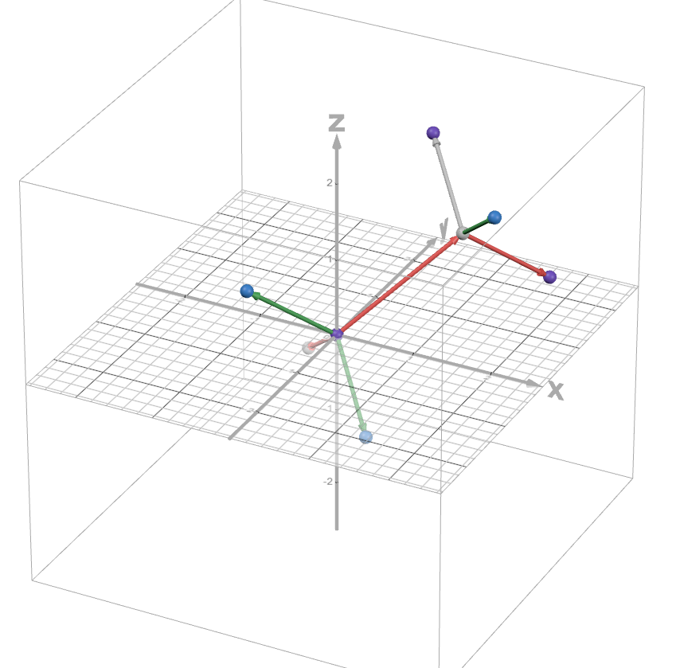

# Entry 1
##### 11/3/24

Ever heard of computational chemistry? It's basically the real thing, just with even more complicated math and programming I can't understand. I'll get it one day.

The tool in question that I'm using for this project is GROMACS. It's less of a tool and more of a software. But here's the kicker: it's open source. And you use it with the CLI. I'll just have to learn C++ or whatever it's made with. 

But for my own project (which is going to be ANOTHER chemistry app, but like, different), I won't be able to fully rely on GROMACS. Really, all it does for me is do all the hard calculations and give me some cool coordinate files to play around with. Since GROMACS is really a molecular dynamics software, it takes in special files as input and outputs other special files to help me analyze the special files used as input so that I can make more special files. Wow!

In order to visualize these files, I need to use VMD (Visual Molecular Dynamics), which is a more conventional software. But it's also open source. Yay!

Alright. The first thing you need for GROMACS is a PDB (Protein Databank) file. You don't have to use it for proteins. It just so happens to be the file used to represent molecules/systems.

A PDB file involves defining [several parameters](https://www.cgl.ucsf.edu/chimera/docs/UsersGuide/tutorials/pdbintro.html). Most importantly, the coordinates, element, residue type (more on this later), and sequence number (basically distinguishing between molecules if there are multiple).

For example, these are the coordinates for a single ethane molecule: 

```
ATOM      1  C1  ETH A   1       0.670  42.555   2.705  1.00  0.00           C
ATOM      2  C2  ETH A   1       0.103  41.100   1.675  1.00  0.00           C
ATOM      3  H1  ETH A   1       1.064  43.544   1.899  1.00  0.00           H
ATOM      4  H2  ETH A   1       1.689  42.181   3.482  1.00  0.00           H
ATOM      5  H3  ETH A   1      -0.340  42.979   3.469  1.00  0.00           H
ATOM      6  H4  ETH A   1       1.108  40.664   0.902  1.00  0.00           H
ATOM      7  H5  ETH A   1      -0.921  41.463   0.889  1.00  0.00           H
ATOM      8  H6  ETH A   1      -0.296  40.099   2.472  1.00  0.00           H
```

How do you get these coordinates, you may ask? If you're dealing with a big macromolecule, you can probably just find the entire file in the protein databank. But I guess those guys never though of doing the same for the smaller molecules, so I have to do it myself. (Boring chemistry incoming)

The carbons in ethane have tetrahedral geometry, so about a 109.5 bond angle. The bond lengths can be looked up in the Computational [Chemistry Comparison and Benchmark DataBase](https://cccbdb.nist.gov/exp2x.asp?casno=74840&charge=0), and from there it's easy to calculate the coordinates given you have a basic knowledge of geometry. For simple molecules like these, I also like to visualize it with 3D graphing tools like Desmos:



Ok now onto the actual tool. With the PDB file, you can have GROMACS to create a topology file with the following command: 

`gmx pdb2gmx -f ethane.pdb -o ethane_processed.gro -p topol.top`

A gro file is basically just another way to represent molecules. You don't have to use it. A topology file includes additional information about the molecule, such as dihedrals, angles, and molar mass.

In order for this command to successfully execute, the residue needs to be defined in GROMACS. ETH is something I just made up. So I need to modify the files in GROMACS so that it knows what it is. 

For a specific forcefield (I will explain this later I promise), I had to edit the `residuetypes.dat` and `aminoacids.rtp` files:

```
[ ETH ]
 [ atoms ]
    C1     opls_135     0.000  0
    C2     opls_135     0.000  1
    H1     opls_140     0.000  0
    H2     opls_140     0.000  0
    H3     opls_140     0.000  0
    H4     opls_140     0.000  1
    H5     opls_140     0.000  1
    H6     opls_140     0.000  1
 [ bonds ]
   C1    C2
   C1    H1
   C1    H2
   C1    H3
   C2    H4
   C2    H5
   C2    H6
```

Basically just saying that if GROMACS encounters this residue in a PDB file, treat the associated atoms and bonds like this.

Skills: There's problem decomposition, because obviously I'm not going to be able to learn this in an entire weekend. I could barely figure it out over an entire summer! Learning each step of how to complete an MD simulation really helps. Aside from that, how to read (seriously?). Because GROMACS is not meant to be very accessible (they don't care enough to give you an actual executable, so I guess it's nice I already know my way around the terminal). To me, most of the GROMACS resources, even the tutorials, seem cryptic. So I'm honestly impressed with myself that I even managed to get this far. 

I'm at step two of the Engineering Design Process. Pretty much just trying to figure out how I can even get this thing to work, but in order to do that I have to of course learn how to use GROMACS. Of course, the whole point of this is to make an easy way to observe chemistry so the average student does not have to go through this too. 

[Next](entry02.md)

[Home](../README.md)