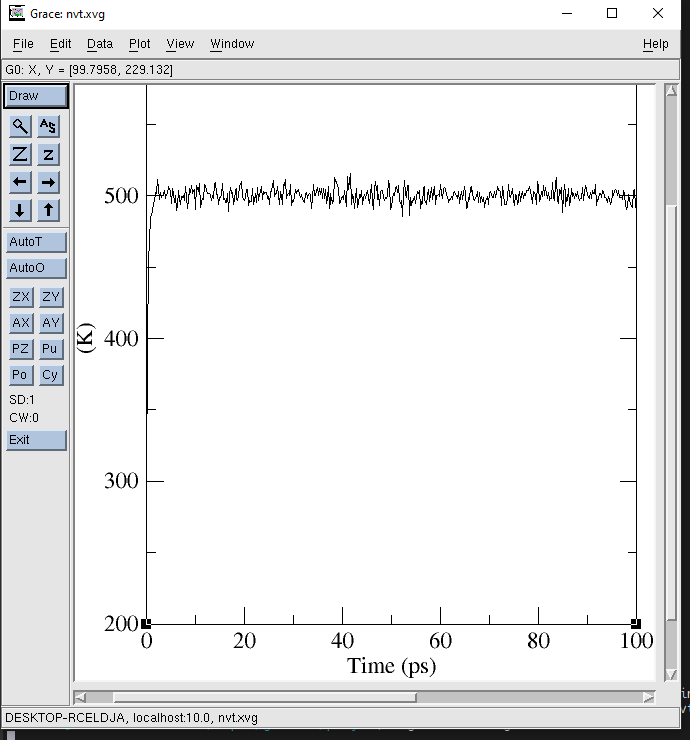

# Entry 2
##### 12/15/24

I've started to realize what my main problem is. I'm not really coding here (But hey, I'm using the CLI and parsing files, so that kinda counts?). It's kind of just my own science project right now. But I'll make it work, either by modifying the source code or making my own package for analyzing molecule systems (I just really want an excuse to use Fortran).

Anyways, before I do any of that, it's probably best that I actually know how to use GROMACS effectively. Because how am I going to make a derived version of something that already exists if I have no idea how it actually works?

OK, so in my simulation I started with a highly unstable grid of ethane and water molecules. In this state therr are a lot of unrealistic bond angles, unrealistic VDWs, not to mention looking very unrealistic. To get to a state where other simulations can actually be performed, the system must reach the minimum amount of potential energy possible. This is why for the first step of my simulation I need to perform energy minimization, which requires several input files: a `gro` or `pdb`, which contain the coordinates of the molecules, a `top`, which contains useful information for each molecule in the system, and an `mdp`, which is basically a set of parameters for GROMACS to use while performing a equilibriation:

```
; File: min.mdp
; GROMACS input file for energy minimization

integrator      = steep           ; Algorithm: steepest descent
emtol           = 1000.0          ; Stop minimization when Fmax < 1000.0 kJ/mol/nm
emstep          = 0.01            ; Maximum step size in nm
nsteps          = 50000           ; Maximum number of minimization steps

; Output control
nstenergy       = 1               ; Frequency to write energies to the log file

; Neighbor searching
cutoff-scheme   = Verlet          ; Use the Verlet cutoff scheme
nstlist         = 10              ; Frequency to update neighbor list
ns_type         = grid            ; Search for neighbors using a grid
rlist           = 1.0             ; Short-range neighbor list cutoff (in nm)

; Electrostatics and Van der Waals
coulombtype     = PME             ; Particle Mesh Ewald for long-range electrostatics
rcoulomb        = 1.0             ; Short-range electrostatic cutoff (in nm)
rvdw            = 1.0             ; Short-range van der Waals cutoff (in nm)

; Apply constraints to bonds
constraints     = none            ; No constraints during energy minimization
```

I'm not totally sure what each parameter does, but here's a basic rundown:

There are several algorithms for EM. [Steep](https://www.youtube.com/watch?v=ZydKMk22rbo) is the most basic one that is easy to use but not necessarily efficient. It basically just moves molecules down a potential energy curve until the most favorable state is reached.

`emtol` basically prevents a diminishing return. It's not necessary to invest more resources (and time) into "overminimizing" for insignificant improvements in the structure of the system.

GROMACS uses cutoff schemes to optimize minimization and computational cost. Verlet is the most simple one, and by setting a cutoff, it ensures that minimal attraction between molecules very far apart are not calculated.

The next step is [NVT equilibriation](https://www.youtube.com/watch?v=5LALoxDs0ic) (constant moles, volume, and temperature). The thing with EM is that it doesn't affect the velocity whatsoever (and is therefore not represented by a function of time t, rather the position of the molecules, r). NVT assigns velocities to each particle (which is directly related to kinetic energy) using a thermostat in order to raise the system to a constant temperature, as seen in this graph: 



And since velocity is the derivative of position, these molecules are obviously going to be moving around quite a bit. As for the `mdp` file used for NVT equilibriation, there are some similar parameters used (such as the number of steps/time, VDWs, and cutoffs), but also some exclusive ones, such as velocity generation:

```
gen_vel         = yes              ; Generate initial velocities
gen_temp        = 300.0            ; Temperature to generate velocities (K)
gen_seed        = -1               ; Random seed for generating velocities
```

As well as temperature coupling (I have no idea what coupling means in this context):

```
tcoupl          = V-rescale        ; Use velocity-rescale thermostat
tc-grps         = System           ; Apply thermostat to the entire system
tau_t           = 0.1              ; Time constant for coupling (ps)
ref_t           = 500.0            ; Reference temperature (K)
```
Essentially saying that the target temperature is 500 Kelvin (we're scientists here).

Finally, there's NPT equlibriation, in which the system is brought to a certain pressure by adjusting the volume. These variables aren't actually arbitrary. The temperature of the system will always be extremely high, meaning that the molecules will be in a gaseous state, in which the Ideal Gas Law can be applied. It's represented by PV = nRT, in which R is constant and n represents the number of moles. Obviously you can't remove molecules in this system, so in order to bring it to a certain temperature without affecting the temperature as well is by allowing the bounds to expand or contract. Which is why it's called NPT. But I digress.

I'm at step 2 of the engineering design process. Still learning! But I'm close to getting the basics down, which is when I'll start coding for real and move on to the third step.

The first skill I've been working on is how to learn. As it turns out, GROMACS is not the only tool used for molecular dynamics. Many concepts such as equilibriation and cutoff schemes are just from comp chem in general. And as such, I had to broaden my search and read resources that did not necessarily tell me exactly how to prepare my simulation, but just understand it better. The other skill would be debugging. Figuring out what parameters to use, which files to parse, and why my commands don't always produce the intended output are all important for me learning how to use GROMACS.


[Previous](entry01.md) | [Next](entry03.md)

[Home](../README.md)
