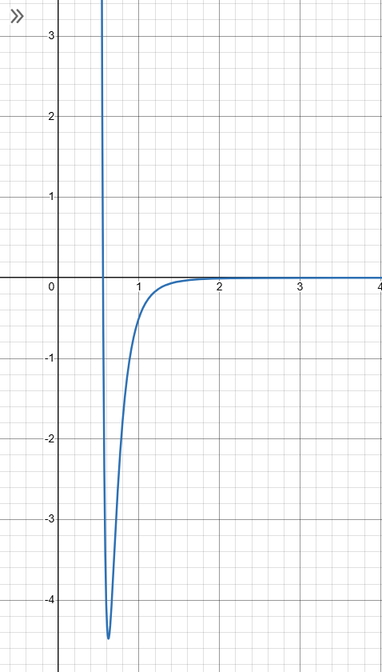

# Entry 5
##### 4/23/25

So I got a lottt of stuff done. Not enough to reach the quality of last years project yet (admittedly), but to be fair this involves way more math.

I order to calculate the acceleration of the molecules, I need the force. The force can be calculated as the negative gradient of potential energy. Which left me with the following questions:

1. How do I even calculate potential energy?
2. What in the world is a gradient?

To answer the first question, a common energy function used in MD is the 12-6 or Lennard-Jones potential. It's relatively simple, with just a repulsive and attractive term:

$$U(r) = 4\epsilon [(\frac{\sigma}{r})^{12} - (\frac{\sigma}{r})^{6}]$$

With sigma and epsilon being constants and r the scalar distance between a pair of molecules.

The sum of potential energies of the pairs between molecule i and every other molecule in the system (j) is a sum of this function for every r<sub>ij</sub> (pairwise distances).

Since I represented each of my molecules as a position vector, I would need to get the displacement first. Since I'm also going to be using periodic boundary conditions from now on, in order to calculate the closest distance, I have to use minimum image convention:

```fortran
DO I = 1, N 
    IF (I.EQ.A) THEN ! EXCLUDE ITH ATOM
        AR = R(I, :)
        CYCLE
    END IF
    NR(NEW_ROW, :) = R(I, :)
    NEW_ROW = NEW_ROW + 1
END DO

DO I = 1, N - 1 ! CALCULATE COMPONENT WISE DISTANCE VECTORS.
    DRV(I, :) = AR - NR(I, :)
    ! MIN IMAGE CONVENTION
    DRV(I, :) = DRV(I, :) - L * NINT(DRV(I, :) / L)
END DO
```

Then I can get the magnitude of the displacement (which is simply the distance):

```fortran
DO I = 1, N - 1 ! CALCULATE EUCLIDEAN DISTANCE FOR EACH ATOM
    DR(I) = SQRT(SUM(DRV(I, :)**2))
END DO
```

Then I can calculate the potential energy:
```fortran
LJPS = 4.00 * EPS * ((SIG/DR)**12-(SIG/DR)**6)
LJP = SUM(LJPS)
```

I still need the force, however. I'm not really going to go into the details about how a gradient works (because to be honest I still don't quite understand it) but the force can be represented as the negative derivative of energy with respect to distance multiplied by the unit vector. This is necessary since even though potential energy is a scalar quantity, the force is a vector:

$$F = -\frac{dU}{dr} * \frac{\vec{r}}{r}$$

For the calculation of force, it's mostly the same idea. I still need to get the displacement and distance so I can calculate the unit vector, and I can represent the derivative as the following:

$$-U'(r) = 24\epsilon [(2\frac{\sigma^{12}}{r^{13}}) - (\frac{\sigma^{6}}{r^{7}})]$$

```fortran
DUDR = 24 * EPS * (2*(SIG**12/DR**13)-(SIG**6/DR**7)) ! CALCULATE DERIVATIVES

DO I = 1, N - 1 ! CALCULATE UNIT VECTORS
    UR(I, :) = DRV(I, :) / DR(I)
END DO

DO I = 1, N - 1
    DLJP(I, :) = UR(I, :) * DUDR(I)
END DO

DLJPS = SUM(DLJP, DIM=1)
```

Then I could calculate the acceleration and update the velocity:
```fortran
SUBROUTINE UPDATE_V(R, V, A)
        REAL, DIMENSION(N, D) :: R, V, F, A
        INTEGER :: I

        DO I = 1, N
            F(I, :) = DLJPOT(R, I)
        END DO

        A = F / M

        V = V + A * DT
        RETURN
    END
```

But here's the problem: At large distances, the slope is so small it is effectively negligible. This I could figure out later because it wasn't the thing breaking my simulation. However, at small distances, the slope is negative and extremely steep. This leads to an extremely high magnitude which of course means molecules have physically impossible repulsion.

</img>

An easy fix to this was setting a hard limit to the force calculated:

```fortran
DUDRM = 16000.0 * M
DUDR = MIN(DUDR, DUDRM)
```
As of now, I don't really have a way of visualizing the system. But what I can do for now is create text files that I can use in software like VMD.

```fortran
SUBROUTINE DUMP(R, V, A, T, I)
    CHARACTER(LEN = 20) :: FILENAME
    REAL, DIMENSION(N, D) :: R, V, A
    REAL :: T
    INTEGER :: I, J

    WRITE(FILENAME, '(A, I0, A)') 'dump/data', I, '.xyz'

    OPEN(1, FILE=FILENAME, STATUS = 'REPLACE')

    WRITE(1, '(I0)') N

    WRITE(1, '(A, F8.3, A, I5)') 'TIME: ', T, ', STEP: ', I
    
    DO J = 1, N
        WRITE(1, '(A1, 3F12.6)') 'H', R(J,1), R(J,2), R(J,3)
    END DO

    CLOSE(1)

    WRITE(FILENAME, '(A, I0, A)') 'dump/vel', I, '.txt'

    OPEN(2, FILE = FILENAME, STATUS = 'REPLACE')

    WRITE(2, '(I0)') N

    WRITE(2, '(A, F8.3, A, I5)') 'TIME: ', T, ', STEP: ', I

    DO J = 1, N
        WRITE(2, '(A1, 6F12.6)') 'H', V(J,1), V(J,2), V(J,3)
    END DO

    WRITE(FILENAME, '(A, I0, A)') 'dump/acc', I, '.txt'

    OPEN(3, FILE = FILENAME, STATUS = 'REPLACE')
    WRITE(3, '(I0)') N

    WRITE(3, '(A, F8.3, A, I5)') 'TIME: ', T, ', STEP: ', I

    DO J = 1, N
        WRITE(3, '(A1, 6F12.6)') 'H', A(J,1), A(J,2), A(J,3)
    END DO

END
```
I can call this function for each step of the simulation. Then I can use a script to stitch them together into a single trajectory file:
```bash
gfortran main.f90 parameters.f90 md.f90 -o main
echo SUCCESSFULLY COMPILED
rm -rf dump/*
./main
if test -f trajectory.xyz; then
    rm trajectory.xyz
fi
for file in $(awk 'FNR==2 {print $NF, FILENAME}' dump/*.xyz | sort -n | awk '{print $2}')
    do
        cat "$file" >> trajectory.xyz
done
for file in $(awk 'FNR==2 {print $NF, FILENAME}' dump/vel*.txt | sort -n | awk '{print $2}')
do
    cat "$file" >> vels.txt
done
for file in $(awk 'FNR==2 {print $NF, FILENAME}' dump/acc*.txt | sort -n | awk '{print $2}')
do
    cat "$file" >> accs.txt
done
echo TRAJECTORY FILE SUCCESSFULLY CREATED
```

This will be helpful for when if I want to make my own 3D rendering engine. But for now I can use this file to visualize my system much easier:

<video src="../img/2mol.mp4"></video>
<video src="../img/nmol.mp4"></video>

I don't know if the videos work. But if they don't, then uhh too bad

A major problem with my simulation was efficiency. At the moment, a 10 second simulation for 2000 molecules takes about 30 minutes to calculate.

The first thing I did was add a shifted potential. Since beyond a certain distance the force acting on a particle can be ignored, I can add a cutoff to assume it is 0 past a certain point. In order to do this, I would always subtract the function of the cutoff point so that the force smoothly decreases to 0.
```fortran
RC = 2.5
DO I = 1, N - 1
    IF (DR(I).LE.2.5) THEN ! SHIFTED FORCE
        DUDR(I) = 24 * EPS * ((2*(SIG**12/DR(I)**13)-(SIG**6/DR(I)**7))-(2*(SIG**12/RC**13)-(SIG**6/RC**7)))
    ELSE
        DUDR(I) = 0 ! FORCE IS EFFECTIVELY ZERO AT LARGE DISTANCES
    END IF
END DO
```

Since at r = 2.5, the energy is very small, subtracting it makes a negligible difference in the actual potential at the equilibrium point.

The next thing I could do was use a better algorithm. At the moment, I was using Euler's method, which was a very simple but inaccurate way of calculating the trajectory of molecules. Even with a small time step like the one I use, this tends to diverge greatly from the original unknown path because it does not conserve energy, leading to high numerical instability.

Velocity-verlet on the other hand is much better at conserving energy and in turn calculating the trajectories. I don't really know why, it just does. Anyways, it's just as easy to implement:

```fortran
SUBROUTINE VEL_VERLET(R, V, A) ! EULER BUT BETTER
    REAL, DIMENSION(N, D) :: R, V, F, A, AN
    INTEGER :: I

    R = R + (V * DT) + (0.5 * A * DT**2) ! UPDATE POSITION

    IF (BC.EQ.1) THEN
        R = MODULO(R, L)
    ELSE 
        CALL REFLECT(R, V)
    END IF

    DO I = 1, N
        F(I, :) = DLJPOT(R, I)
    END DO

    AN = F / M

    V = V + (0.5 * (A + AN) * DT) ! UPDATE VELOCITY

    A = AN

    RETURN
END
```

[Previous](entry04.md) | [Next](entry06.md)

[Home](../README.md)